# Scry System Architecture and User Flow Diagrams

Visual representations of the enhanced Phase 1 prototype for quick understanding.

## System Architecture Overview

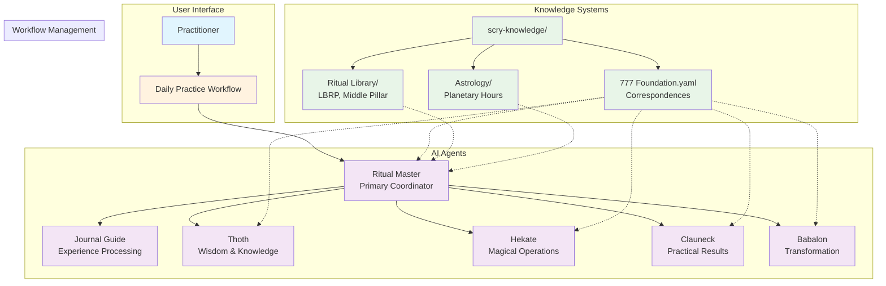

## Daily Practice Workflow - Complete User Journey

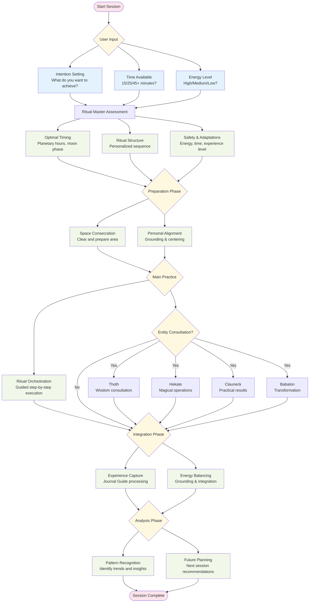

## Agent Coordination Patterns

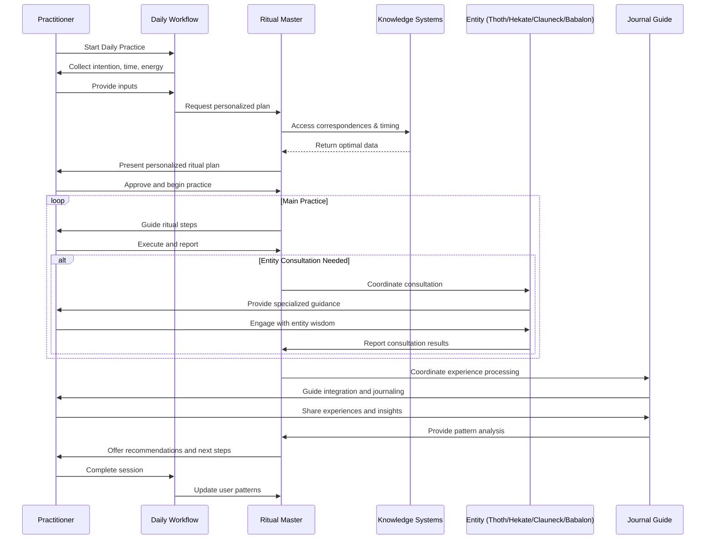

## Knowledge System Integration

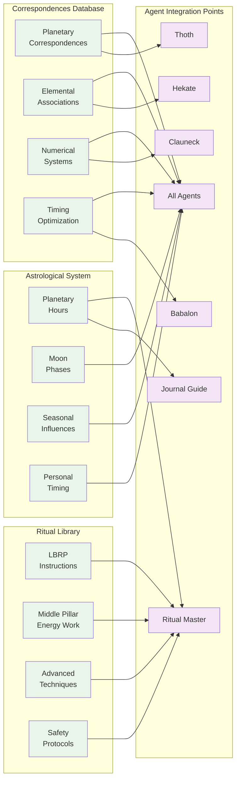

## User Experience Paths

### Beginner Journey (First 2 Weeks)
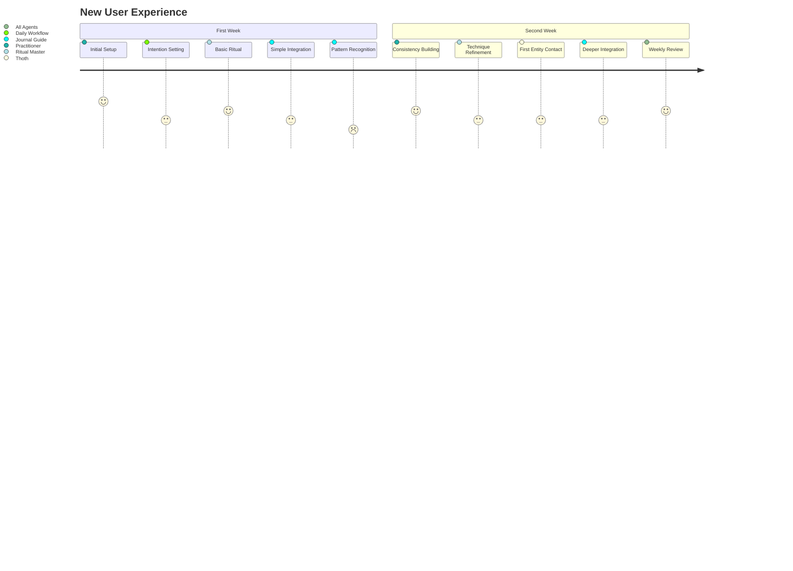

### Advanced User Journey
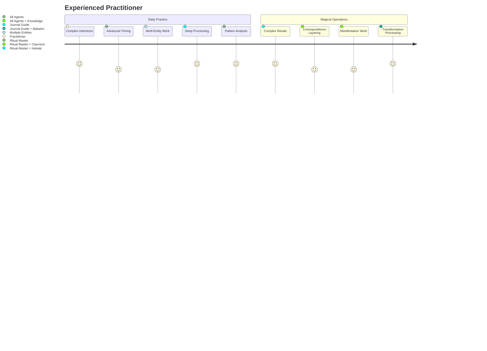

## Safety and Adaptation Framework

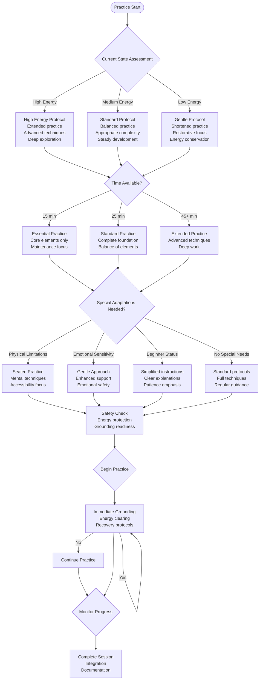

## Pattern Recognition and Learning Cycle

```mermaid
flowchart TD
    Practice([Daily Practice]) --> Capture{Experience Capture}

    Capture --> Physical[Physical Sensations<br/>Energy movements<br/>Body responses]
    Capture --> Mental[Mental States<br/>Thoughts patterns<br/>Insights received]
    Capture --> Emotional[Emotional responses<br/>Processing needs<br/>Integration status]
    Capture --> Spiritual[Spiritual experiences<br/>Entity interactions<br/>Consciousness shifts]

    Physical --> Store[Store Experience Data]
    Mental --> Store
    Emotional --> Store
    Spiritual --> Store

    Store --> Analyze[Pattern Analysis Engine]

    Analyze --> Timing[Timing Patterns<br/>Optimal practice times<br/>Astrological correlations]
    Analyze --> Technique[Technique Effectiveness<br/>Personal preferences<br/>Skill development]
    Analyze --> Energy[Energy Patterns<br/>Developmental cycles<br/>Integration needs]
    Analyze -> Life[Life Impact<br/>Practical applications<br/>Synchronicities]

    Timing --> Optimize[Optimization Algorithms]
    Technique --> Optimize
    Energy --> Optimize
    Life --> Optimize

    Optimize --> Personalize[Personalization Engine]
    Personalize --> Practice
```

## Web App Migration Architecture

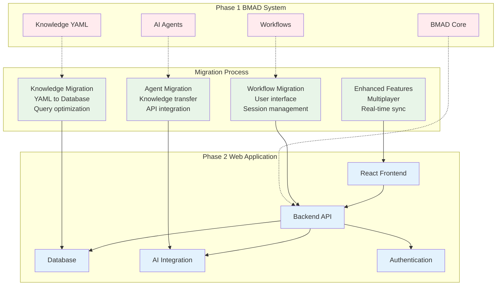

## Usage Statistics and Metrics

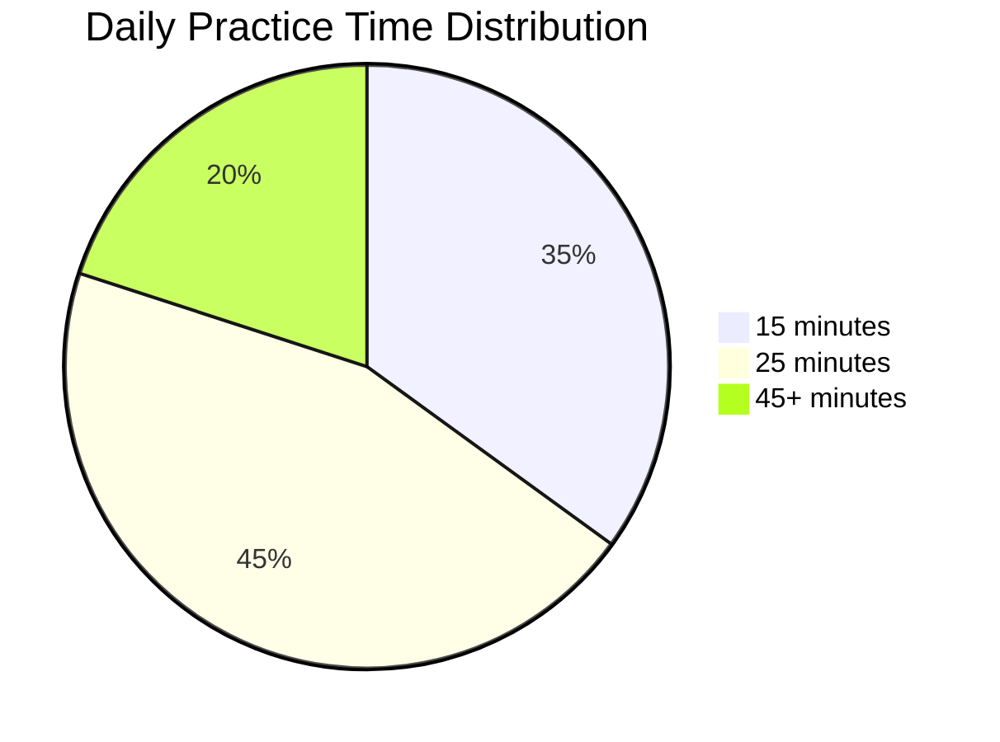

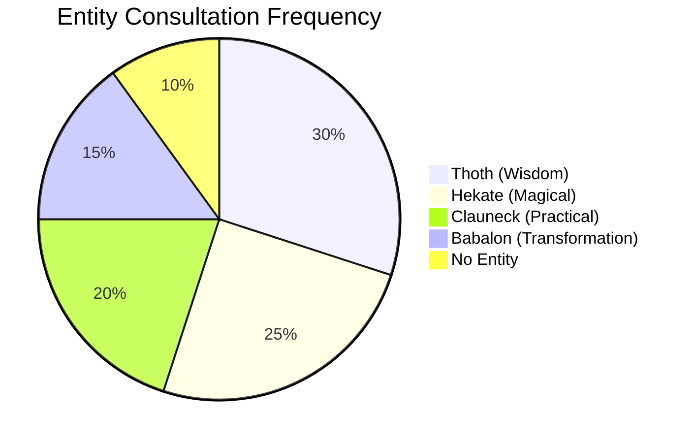

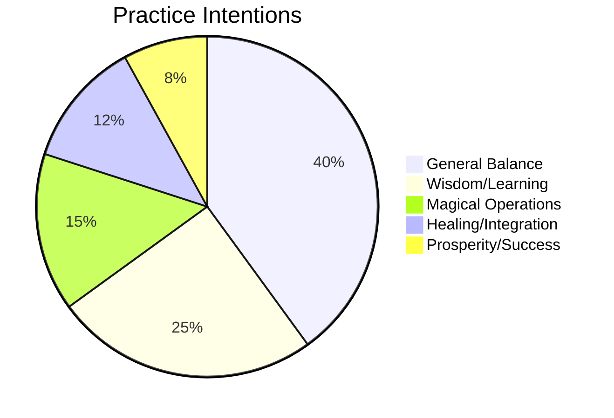

These diagrams provide at-a-glance understanding of:
- **System architecture** and component relationships
- **User workflows** and decision points
- **Agent coordination** patterns
- **Knowledge integration** structure
- **Safety protocols** and adaptation frameworks
- **Learning cycles** and pattern recognition
- **Migration path** to full web application

Use these as quick references when explaining the system to new users or stakeholders!